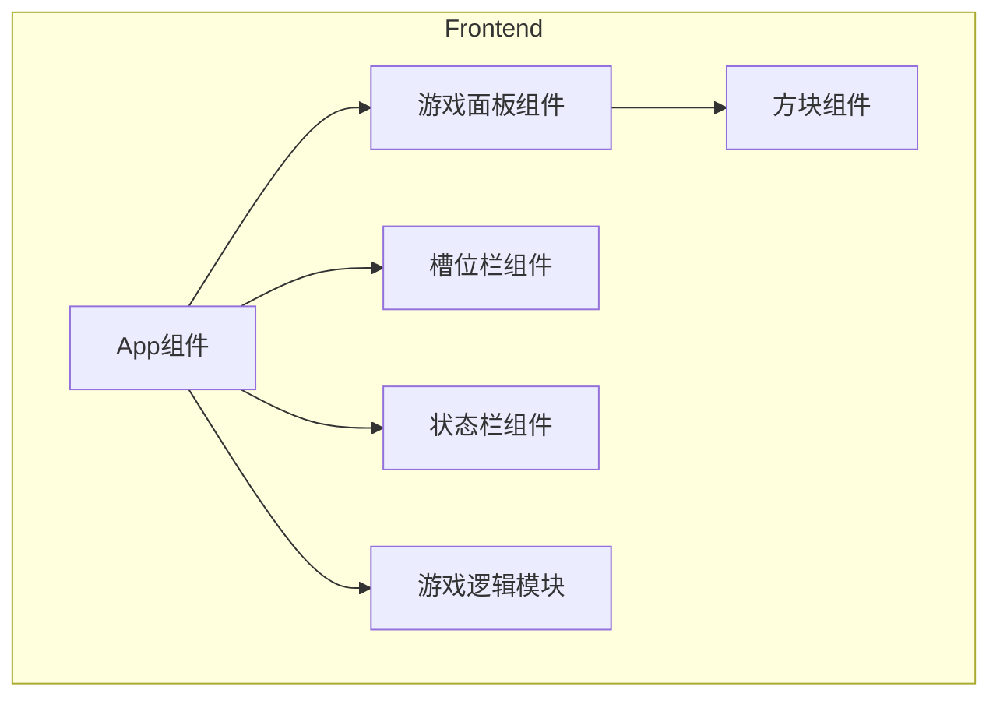

## 1. Architecture Design
单页应用架构，前端使用 React + TypeScript + Vite 构建，无需后端服务，所有游戏逻辑在前端完成。



## 2. Technology Description
- Frontend: React@18 + TypeScript + TailwindCSS@3 + Vite
- Initialization Tool: vite-init
- Backend: None
- State Management: React useState/useEffect hooks

## 3. Route Definitions
| Route | Purpose |
|-------|---------|
| / | 游戏主界面 |

## 4. Core Data Structures

### 4.1 方块数据结构
```typescript
interface Tile {
  id: string;
  type: string; // 方块类型（表情符号）
  x: number; // 网格x坐标
  y: number; // 网格y坐标
  layer: number; // 层级
  isSelected: boolean; // 是否已选中
  isRemoved: boolean; // 是否已消除
}
```

### 4.2 游戏状态
```typescript
interface GameState {
  tiles: Tile[];
  slot: string[]; // 槽位中的方块类型
  eliminatedPairs: number; // 已消除对数
  isGameOver: boolean;
  isVictory: boolean;
}
```

## 5. Core Functions

### 5.1 游戏初始化
- 生成多层方块布局
- 每种方块类型数量为3的倍数
- 确保方块有适当的堆叠

### 5.2 方块选择
- 检查方块是否为顶层（无覆盖）
- 添加到槽位
- 检查是否满足消除条件

### 5.3 消除逻辑
- 检查槽位中是否有3个相同类型
- 自动消除并播放动画
- 更新游戏状态

### 5.4 游戏结束判定
- 胜利条件：所有方块已消除
- 失败条件：槽位已满且无3个相同方块

## 6. File Structure
```
/workspace
├── src/
│   ├── components/
│   │   ├── GameBoard.tsx      # 游戏面板组件
│   │   ├── Tile.tsx           # 方块组件
│   │   ├── SlotBar.tsx        # 槽位栏组件
│   │   └── StatusBar.tsx      # 状态栏组件
│   ├── utils/
│   │   └── gameLogic.ts       # 游戏逻辑工具
│   ├── App.tsx                # 主应用组件
│   └── main.tsx               # 入口文件
├── index.html
├── package.json
├── tsconfig.json
├── vite.config.ts
└── tailwind.config.js
```
