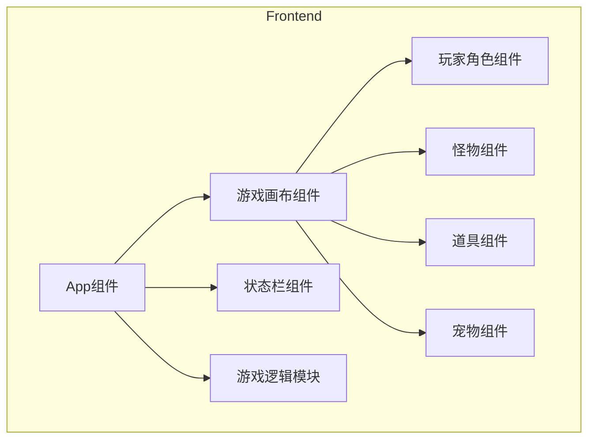

## 1. Architecture Design
单页应用架构，前端使用 React + TypeScript + Vite 构建，游戏使用 Canvas 或 DOM 实现，无需后端服务，所有游戏逻辑在前端完成。



## 2. Technology Description
- Frontend: React@18 + TypeScript + TailwindCSS@3 + Vite
- Initialization Tool: vite-init
- Backend: None
- State Management: React useState/useEffect hooks + useRef for animation loop
- Game Rendering: CSS positioning + transforms

## 3. Route Definitions
| Route | Purpose |
|-------|---------|
| / | 游戏主界面 |

## 4. Core Data Structures

### 4.1 角色数据结构
```typescript
interface Player {
  id: string;
  x: number;
  y: number;
  level: number;
  points: number;
  hp: number;
  maxHp: number;
  speed: number;
  emoji: string;
}
```

### 4.2 怪物数据结构
```typescript
interface Monster {
  id: string;
  x: number;
  y: number;
  level: number;
  points: number;
  emoji: string;
  speed: number;
  direction: { x: number; y: number };
  isAlive: boolean;
}
```

### 4.3 道具数据结构
```typescript
interface Item {
  id: string;
  x: number;
  y: number;
  type: 'points' | 'hp' | 'speed';
  value: number;
  emoji: string;
  isCollected: boolean;
}
```

### 4.4 宠物数据结构
```typescript
interface Pet {
  id: string;
  x: number;
  y: number;
  emoji: string;
  isActive: boolean;
}
```

### 4.5 游戏状态
```typescript
interface GameState {
  player: Player;
  monsters: Monster[];
  items: Item[];
  pet: Pet | null;
  isGameOver: boolean;
  isVictory: boolean;
}
```

## 5. Core Functions

### 5.1 游戏初始化
- 初始化玩家（平民，初始生命值，初始位置
- 生成随机分布的怪物
- 生成随机道具
- 初始化宠物

### 5.2 玩家移动
- 键盘控制（WASD/方向键
- 边界检测
- 速度控制

### 5.3 碰撞检测
- 检测玩家与怪物碰撞
- 检测玩家与道具碰撞
- 根据等级比较判断

### 5.4 怪物AI
- 怪物随机移动
- 怪物自动躲避
- 边界反弹

### 5.5 游戏结束判定
- 胜利条件：所有怪物消灭
- 失败条件：生命值耗尽

## 6. File Structure
```
/workspace
├── src/
│   ├── components/
│   │   ├── GameCanvas.tsx    # 游戏画布组件
│   │   ├── Player.tsx       # 玩家组件
│   │   ├── Monster.tsx      # 怪物组件
│   │   ├── Item.tsx         # 道具组件
│   │   ├── StatusBar.tsx     # 状态栏组件
│   ├── utils/
│   │   └── gameLogic.ts     # 游戏逻辑工具
│   ├── types/
│   │   └── game.ts          # 游戏类型定义
│   ├── App.tsx                # 主应用组件
│   └── main.tsx               # 入口文件
├── index.html
├── package.json
├── tsconfig.json
├── vite.config.ts
└── tailwind.config.js
```
