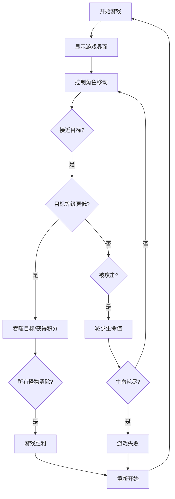

## 1. Product Overview
修仙小游戏是一款类似"大鱼吃小鱼"的休闲游戏，玩家扮演修仙者从平民开始，通过吞噬低等级怪物和收集道具来提升修为。
- 主要功能：玩家移动、怪物吞噬、积分系统、宠物跟随、游戏重置
- 目标用户：休闲游戏爱好者，提供轻松有趣的修仙体验

## 2. Core Features

### 2.1 Feature Module
1. **游戏主界面**：游戏地图、玩家角色、游戏状态显示、操作按钮
2. **角色系统**：主角移动、等级进阶、生命值显示
3. **怪物系统**：多种怪物类型、不同等级/积分、随机移动
4. **道具系统**：加分道具、生命道具、加速道具
5. **宠物系统**：宠物跟随、协助攻击、提供加成

### 2.3 Page Details
| Page Name | Module Name | Feature description |
|-----------|-------------|---------------------|
| 游戏主界面 | 游戏地图 | 800x600像素的地图区域，角色自由移动 |
| 游戏主界面 | 状态栏 | 显示当前修为等级、积分、生命值 |
| 游戏主界面 | 操作栏 | 重新开始按钮、游戏说明 |

## 3. Core Process
玩家进入游戏 → 控制角色移动 → 吞噬比自己等级低的怪物/收集道具 → 积分增加/等级提升 → 继续升级挑战更高等级怪物 → 挑战所有怪物通关或生命耗尽失败

## 4. User Interface Design
### 4.1 Design Style
- 主色调：紫色系（#9333ea）和金色（#fbbf24），营造修仙氛围
- 辅助色：青色（#06b6d4）作为强调色
- 按钮风格：圆角按钮，带有发光效果和悬停动画
- 字体：使用游戏风格字体，标题字体大且加粗
- 布局风格：居中游戏画面，侧边或顶部状态栏
- 图标风格：使用 emoji 作为角色和怪物图标，色彩鲜明

### 4.2 Page Design Overview
| Page Name | Module Name | UI Elements |
|-----------|-------------|-------------|
| 游戏主界面 | 游戏区域 | 深色背景地图，带网格效果，角色发光效果 |
| 游戏主界面 | 状态栏 | 金色边框卡片，清晰的数字显示 |
| 游戏主界面 | 操作按钮 | 渐变背景按钮，点击有特效 |

### 4.3 Responsiveness
- 桌面端优先设计，同时适配移动端
- 移动端优化游戏区域尺寸和触摸控制
- 响应式布局，适应不同屏幕尺寸

### 4.4 游戏玩法设计说明
1. **角色类型**：使用 emoji 作为角色（🧑、👤、🧙、⚡、👑）
2. **怪物类型**：多种怪物（🐀、🐺、🐍、🦅、🐉）
3. **等级系统**：平民→修士→真人→宗师→仙君→仙帝
4. **移动机制**：键盘/WASD或方向键控制，或触摸滑动
5. **吞噬规则**：只能吞噬比自己等级低的目标
6. **胜利条件**：吞噬所有怪物
7. **失败条件**：生命值耗尽
