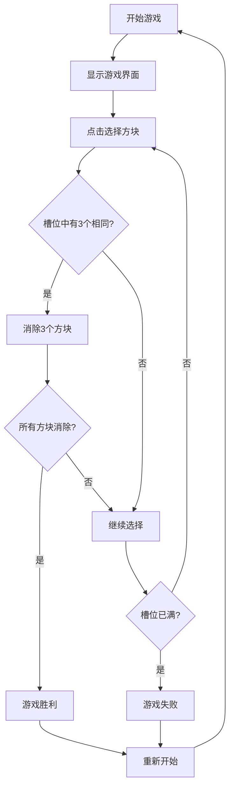

## 1. Product Overview
羊了个羊是一款经典的三消小游戏复刻，玩家通过消除相同图案的方块来通关游戏。
- 主要功能：游戏主界面、方块消除、计分系统、关卡重置
- 目标用户：休闲游戏爱好者，提供轻松有趣的游戏体验

## 2. Core Features

### 2.1 Feature Module
1. **游戏主界面**：游戏区域、游戏状态显示、操作按钮
2. **方块消除系统**：点击选择方块、3个相同方块消除、消除动画
3. **计分和状态系统**：剩余方块数、已消除对数、游戏结束判定

### 2.3 Page Details
| Page Name | Module Name | Feature description |
|-----------|-------------|---------------------|
| 游戏主界面 | 游戏区域 | 多层堆叠的方块展示，可点击选择 |
| 游戏主界面 | 状态栏 | 显示已消除对数、剩余方块数、游戏状态 |
| 游戏主界面 | 操作栏 | 重新开始按钮、游戏规则说明 |

## 3. Core Process
玩家进入游戏 → 看到多层堆叠的方块 → 点击选择方块（最多7个） → 收集3个相同方块自动消除 → 继续消除直到所有方块消除（胜利）或槽位满了无法消除（失败）

## 4. User Interface Design
### 4.1 Design Style
- 主色调：绿色系（#4ade80）和天蓝色（#60a5fa），营造轻松愉快的氛围
- 辅助色：橙色（#f97316）作为强调色
- 按钮风格：圆角卡片式按钮，带有轻微阴影和悬停效果
- 字体：使用Poppins字体，标题字体较大加粗，内容字体适中
- 布局风格：居中卡片式布局，游戏区域突出显示
- 图标风格：使用表情符号作为方块图案，色彩鲜艳

### 4.2 Page Design Overview
| Page Name | Module Name | UI Elements |
|-----------|-------------|-------------|
| 游戏主界面 | 游戏区域 | 网格布局的方块卡片，带有层级阴影，悬停放大效果 |
| 游戏主界面 | 状态栏 | 明亮的背景卡片，清晰的数字显示 |
| 游戏主界面 | 选择槽 | 底部水平排列的槽位，显示当前选中的方块 |
| 游戏主界面 | 操作按钮 | 渐变背景的圆角按钮，点击有动画反馈 |

### 4.3 Responsiveness
- 桌面端优先设计，同时适配移动端
- 移动端优化方块大小和触摸区域
- 响应式布局，适应不同屏幕尺寸

### 4.4 游戏玩法设计说明
1. **方块类型**：使用10种不同的表情符号作为方块图案（🐑、🐄、🐖、🐔、🐕、🐈、🐰、🐿️、🦔、🐿️）
2. **堆叠设计**：方块多层堆叠，只有顶层方块可点击
3. **选择机制**：点击方块添加到底部槽位（最多7个）
4. **消除规则**：槽位中有3个相同方块时自动消除
5. **胜利条件**：所有方块消除完毕
6. **失败条件**：槽位已满且无法消除
